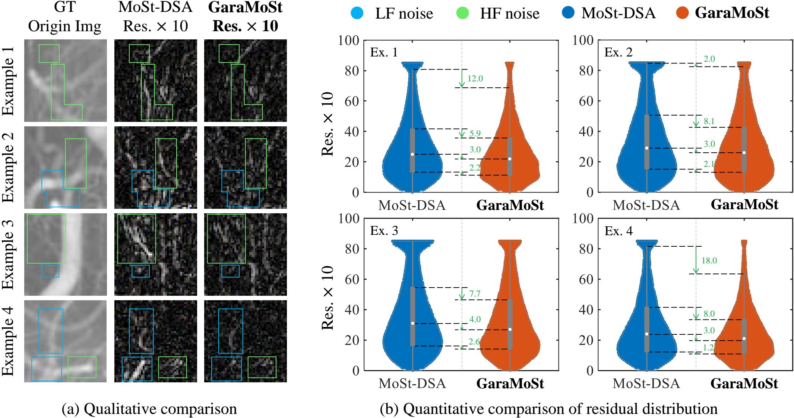
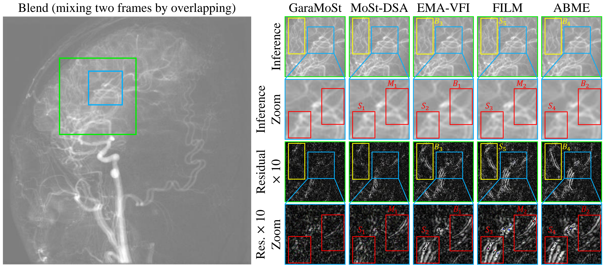

<div align="center">
<h1>GaraMoSt</h1>
<h3>Parallel Multi-Granularity Motion and Structural Modeling for Efficient Multi-Frame Interpolation in DSA Images</h3>

[Ziyang Xu](https://ziyangxu.top/)<sup>1</sup>, Huangxuan Zhao<sup>2,3</sup>, [Wenyu Liu](http://eic.hust.edu.cn/professor/liuwenyu/)<sup>1</sup>, [Xinggang Wang](https://xwcv.github.io/)<sup>1 :email:</sup>
(<sup>:email:</sup>) corresponding author.

<sup>1</sup> Institute of AI, School of Electronic Information and Communications, Huazhong University of Science and Technology, Wuhan, China.
<sup>2</sup> Department of Radiology, Union Hospital, Tongji Medical College, Huazhong University of Science and Technology, Wuhan, China.
<sup>3</sup> School of Computer Science, Wuhan University, Wuhan, China.

[](https://ojs.aaai.org/index.php/AAAI/article/view/35076) [](LICENSE)
</div>

<div align="center">

</div>

## 🔔 News

* **`April 21, 2025`:**  We released our code. If you found it helpful, please give us a star 🌟 and cite our paper. 🤗

* **`April 15, 2025`:**  AAAI-25 Conference Proceedings are now available, and you can find our paper [here](https://ojs.aaai.org/index.php/AAAI/article/view/35076). Enjoy~ 🍻

* **`December 10, 2024`:**  GaraMoSt is accepted to AAAI-25! 🍻 The [preprint paper](https://arxiv.org/abs/2412.14118) can be found on arxiv.

## 🔖 Abstract
The rapid and accurate direct multi-frame interpolation method for Digital Subtraction Angiography (DSA) images is crucial for reducing radiation and providing real-time assistance to physicians for precise diagnostics and treatment. DSA images contain complex vascular structures and various motions. Applying natural scene Video Frame Interpolation (VFI) methods results in motion artifacts, structural dissipation, and blurriness. Recently, MoSt-DSA has specifically addressed these issues for the first time and achieved SOTA results. However, MoSt-DSA's focus on real-time performance leads to insufficient suppression of high-frequency noise and incomplete filtering of low-frequency noise in the generated images. To address these issues within the same computational time scale, we propose GaraMoSt. Specifically, we optimize the network pipeline with a parallel design and propose a module named MG-MSFE. MG-MSFE extracts frame-relative motion and structural features at various granularities in a fully convolutional parallel manner and supports independent, flexible adjustment of context-aware granularity at different scales, thus enhancing computational efficiency and accuracy. Extensive experiments demonstrate that GaraMoSt achieves the SOTA performance in accuracy, robustness, visual effects, and noise suppression, comprehensively surpassing MoSt-DSA and other natural scene VFI methods.

## 🚀 Highlights

* Compared to MoSt-DSA, GaraMoSt further enhances the suppression of HF (high frequency) and LF (low frequency) noise in interpolated images, with inference time maintained at the same level (for interpolating 3 frames, only increasing by 0.005s), enabling real-time assistance for more precise diagnostic and therapeutic procedures by physicians.

<div align="center">

</div>

<br>

*  GaraMoSt achieves SOTA performance in accuracy, robustness, visual
effects, and noise suppression, comprehensively surpassing MoSt-DSA and other natural scene VFI methods.

<div align="center">

</div>

## 📦 Environment Setups

* python 3.8
* cudatoolkit 11.2.1
* cudnn 8.1.0.77
* See 'GaraMoSt_env.txt' for Python libraries required

```shell
conda create -n GaraMoSt python=3.8
conda activate GaraMoSt
conda install cudatoolkit=11.2.1 cudnn=8.1.0.77
pip install torch==1.9.0+cu111 torchvision==0.10.0+cu111 -f https://download.pytorch.org/whl/torch_stable.html
# cd /xx/xx/GaraMoSt
pip install -r GaraMoSt_env.txt
```

## 🗃️ Model Checkpoints
Download the checkpoints of [single-frame interpolation](https://drive.google.com/file/d/1lFbDJ7B9ildsfkJrO7xZnA-rrvAZi5Z9/view?usp=sharing), [two-frame interpolation](https://drive.google.com/file/d/1fGQgEjR8NJJcwbuuChFNUzom8xngKVi2/view?usp=sharing), [three-frame interpolation](https://drive.google.com/file/d/1MTmIlVpvS-_5fYaBjdKjPDrLTS_YB6Qc/view?usp=sharing), and put all pkl files into ../GaraMoSt/weights/checkpoints. You can use these checkpoints as pre-training weights or for inference.

## 🎞️ Inference Demo
Run the following commands to generate single/multi-frame interpolation:

* Single-frame interpolation
```shell
python Simple_Interpolator.py \
--model_path ./weights/checkpoints/inf1_r7-r7_best.pkl \
--frame1 ./demo_images/DSA_a.png \
--frame2 ./demo_images/DSA_b.png \
--inter_frames 1
```

* Two-frame interpolation
```shell
python Simple_Interpolator.py \
--model_path ./weights/checkpoints/inf2_r7-r29_best.pkl \
--frame1 ./demo_images/DSA_a.png \
--frame2 ./demo_images/DSA_b.png \
--inter_frames 2
```

* Three-frame interpolation
```shell
python Simple_Interpolator.py \
--model_path ./weights/checkpoints/inf3_r7-r29_best.pkl \
--frame1 ./demo_images/DSA_a.png \
--frame2 ./demo_images/DSA_b.png \
--inter_frames 3
```

## 🚂 Training on your medical datasets
### Data Preparation
You should extract consecutive frames of data and then organize your dataset as follows:

* For single-frame interpolation
```
├── <Your_datasets_root>
│    ├── Data_part_1
│        ├── Sequence_1
│            ├── frame_1.png
│            ├── frame_2_gt.png
│            ├── frame_3.png
│        ├── Sequence_2
│            ├── frame_1.png
│            ├── frame_2_gt.png
│            ├── frame_3.png
│        ├── ...
│    ├── Data_part_2
│        ├── Sequence_1
│            ├── frame_1.png
│            ├── frame_2_gt.png
│            ├── frame_3.png
│        ├── Sequence_2
│            ├── frame_1.png
│            ├── frame_2_gt.png
│            ├── frame_3.png
│        ├── ...
│    | ...
```

* For multi-frame interpolation(for example, three-frame)
```
├── <Your_datasets_root>
│    ├── Data_part_1
│        ├── Sequence_1
│            ├── frame_1.png
│            ├── frame_2_gt.png
│            ├── frame_3_gt.png
│            ├── frame_4_gt.png
│            ├── frame_5.png
│        ├── Sequence_2
│            ├── frame_1.png
│            ├── frame_2_gt.png
│            ├── frame_3_gt.png
│            ├── frame_4_gt.png
│            ├── frame_5.png
│        ├── ...
│    ├── Data_part_2
│        ├── Sequence_1
│            ├── frame_1.png
│            ├── frame_2_gt.png
│            ├── frame_3_gt.png
│            ├── frame_4_gt.png
│            ├── frame_5.png
│        ├── Sequence_2
│            ├── frame_1.png
│            ├── frame_2_gt.png
│            ├── frame_3_gt.png
│            ├── frame_4_gt.png
│            ├── frame_5.png
│        ├── ...
│    | ...
```

Also, you should list the paths of all the sequences for train-set and test-set by making TrainList.txt and TestList.txt, as follows:
* Make TrainList.txt for train-set. Each line in txt corresponds to a sequence path, like:
```
Data_part_1/Sequence_1
Data_part_1/Sequence_2
Data_part_1/Sequence_3
Data_part_1/Sequence_4
Data_part_2/Sequence_1
Data_part_2/Sequence_2
Data_part_2/Sequence_3
Data_part_2/Sequence_4
...
```
* Make TestList.txt for test-set. Each line in txt corresponds to a sequence path, like:
```
Data_part_301/Sequence_1
Data_part_301/Sequence_2
Data_part_301/Sequence_3
Data_part_301/Sequence_4
Data_part_302/Sequence_1
Data_part_302/Sequence_2
Data_part_302/Sequence_3
Data_part_302/Sequence_4
...
```

### Download weight for Multi-loss Calculation
For calculating style loss and perceptual loss, download [weight](https://drive.google.com/file/d/1NnMnRCGHOGjXHZ7Se2_q5c86L0XkMTBq/view?usp=sharing) and put it into ../GaraMoSt/weights/vgg_weight.


### Training Commands
Taking the training single-frame interpolation model as an example. You can also modify the "--inter_frames" value to specify other number of interpolation frames. If you try to do so, please make sure that "--data_path" and "--txt_path" correspond to the "--inter_frames".

#### Single-machine Single-GPU Training
```shell
CUDA_VISIBLE_DEVICES=0 \
python -m torch.distributed.launch --nproc_per_node=1 --master_port 37501 Train_Test_Pipe.py \
--world_size 1 \
--batch_size 8 \
--data_path /xx/xx/Your_datasets_root \
--txt_path /xx/xx/txts_root/that/has/TrainList/and/TestList/txt \
--inter_frames 1 \
--model_save_name xxx_model \
--note name_of_log_folder \
--note_print xxx_experiment \
--max_epochs 100 \
--lr_strategy_sets "{'strategy': 'ori-custom', 'base_lr': 2e-4, 'milestones': [2000], 'gamma': 0.1, 'continue_lr': 0.}" \
--losses_weight_schedules "[{'boundaries_epoch':[0], 'boundaries_step':[], 'values':[1.0, 1.0]},
                            {'boundaries_epoch':[0], 'boundaries_step':[], 'values':[1.0, 0.25]},
                            {'boundaries_epoch':[2], 'boundaries_step':[], 'values':[0.0, 40.0]}]" \
--context_aware_granularity "{'high-level': 7, 'low-level': 7}" \
--pretrain_weight ./weights/checkpoints/inf1_r7-r7_best.pkl
```

#### Single-machine Multi-GPU Training
```shell
CUDA_VISIBLE_DEVICES=0,1,2,3 \
python -m torch.distributed.launch --nproc_per_node=4 --master_port 37502 Train_Test_Pipe.py \
--world_size 4 \
--batch_size 8 \
--data_path /xx/xx/Your_datasets_root \
--txt_path /xx/xx/txts_root/that/has/TrainList/and/TestList/txt \
--inter_frames 1 \
--model_save_name xxx_model \
--note name_of_log_folder \
--note_print xxx_experiment \
--max_epochs 100 \
--lr_strategy_sets "{'strategy': 'ori-custom', 'base_lr': 2e-4, 'milestones': [2000], 'gamma': 0.1, 'continue_lr': 0.}" \
--losses_weight_schedules "[{'boundaries_epoch':[0], 'boundaries_step':[], 'values':[1.0, 1.0]},
                            {'boundaries_epoch':[0], 'boundaries_step':[], 'values':[1.0, 0.25]},
                            {'boundaries_epoch':[2], 'boundaries_step':[], 'values':[0.0, 40.0]}]" \
--context_aware_granularity "{'high-level': 7, 'low-level': 7}" \
--pretrain_weight ./weights/checkpoints/inf1_r7-r7_best.pkl
```

## 📈 Evaluate on your medical datasets
Taking the evaluating single-frame interpolation model as an example. You can also modify the "--inter_frames" value to specify other number of interpolation frames. If you try to do so, please make sure that "--data_path" and "--txt_path" correspond to the "--inter_frames".

```shell
CUDA_VISIBLE_DEVICES=0 \
python -m torch.distributed.launch --nproc_per_node=1 --master_port 37503 Train_Test_Pipe.py \
--world_size 1 \
--data_path /xx/xx/Your_datasets_root \
--txt_path /xx/xx/txts_root/that/has/TrainList/and/TestList/txt \
--inter_frames 1 \
--note Eval-Model-xxx \
--note_print My-Eval-Inf1 \
--pretrain_weight /xxx/xxx/xxx/modelxxx.pkl \
--eval_mode True
```

## 💖 Citation
Please feel free to give us a star 🌟 and cite our paper!
```shell
@inproceedings{xu2025garamost,
  title={GaraMoSt: Parallel Multi-Granularity Motion and Structural Modeling for Efficient Multi-Frame Interpolation in DSA Images},
  author={Xu, Ziyang and Zhao, Huangxuan and Liu, Wenyu and Wang, Xinggang},
  booktitle={Proceedings of the AAAI Conference on Artificial Intelligence},
  volume={39},
  number={27},
  pages={28530--28538},
  year={2025}
}
```
